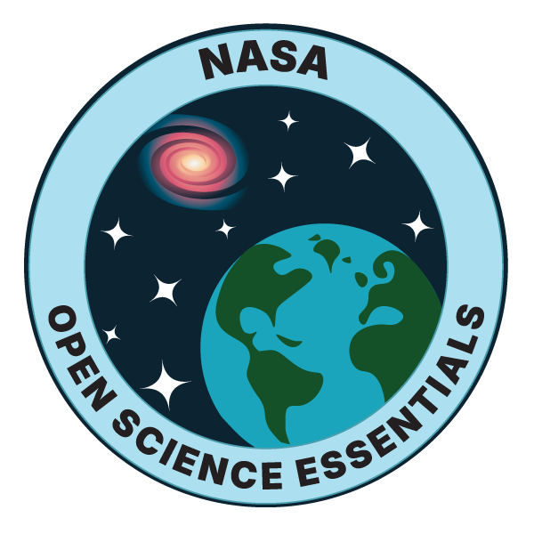

## Hi, I'm Reizno 👋
## About Me

  

I'm a autodidact  who enjoys exploring technology through hands-on projects and experimentation.

I'm currently using an **Arduino Starter Kit** to learn the fundamentals of electronics, programming, and problem-solving while discovering how ideas can become real projects.

I'm still exploring different areas of technology to find what interests me most. I'm especially curious about **energy, light, electronics, I'm interested in Figma, digital design, creative coding.

My goal is to keep learning, experimenting, and building — and eventually create whatever I can imagine.

## 🌱 Currently Exploring

- Arduino and electronics
- Programming fundamentals
- Energy and light
- Hands-on experimentation
- Creative technology projects

## 🛠️ Skills

- Learning through experimentation
- Problem-solving
- Electronics fundamentals
- Programming fundamentals

## 🎮 Outside of Tech

- Console gaming 🎮
- Online streaming 📺
- Matcha green lattes 🍵
- I'm also interested in Missing 411 and the stories, cases, and mysteries surrounding unexplained disappearances. 🧭🌲

## 🚀 Projects

🔎 Future Project Idea — Missing 411 & Open Science

While taking NASA's Open Science Essentials for STEM course, I started thinking about how open-science ideas could be applied to a topic I'm personally interested in: Missing 411 and missing-person cases associated with national parks.

I originally became interested in the project after supporting it through a financial donation. Although I've never participated directly in a research or open-science project like this, the course got me thinking about how documented cases could potentially be organized into an open, transparent dataset.

A possible project could explore case timelines, last-known and recovery locations, distance traveled, elevation, terrain, environmental conditions, and other documented information. An interactive map and standardized dataset could potentially help researchers independently explore geographic and environmental patterns.

I don't know if this exact approach has already been done, so I'd first want to research existing projects and databases before deciding whether there is something new I could build or contribute to.

For now, it's simply an idea that came from a five-minute brainstorming exercise — but it could become an interesting future project. 🌱

Curious → Experimenting →  Exploring → Learning → Building → Creating

## 📫 Contact

TBA

## 📺 Find Me

- YouTube: TBA
- Twitch: TBA

😄 **Current status:** *Skill issue: currently being patched.*
---

This profile is a work in progress as I continue learning, experimenting, and discovering what I want to build.
