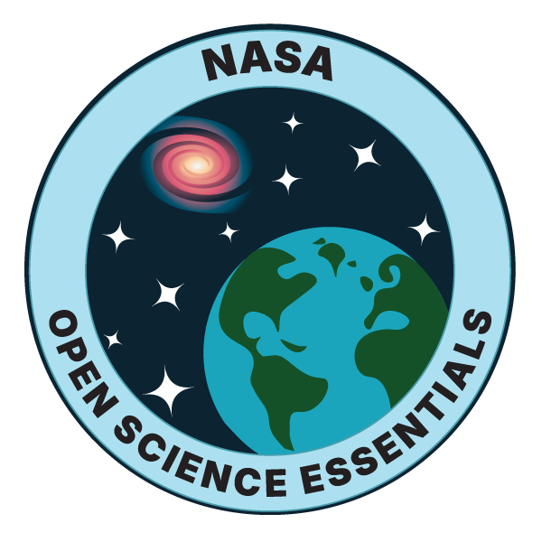
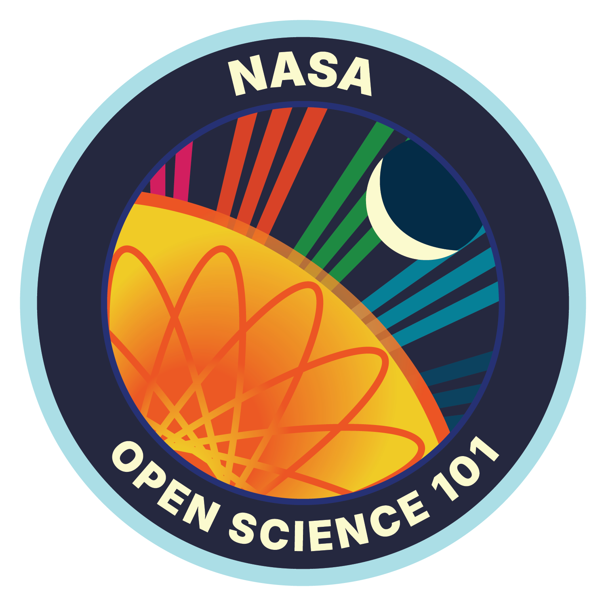

## Hi, I'm Reizno 👋
## About Me

  
  

I'm a autodidact  who enjoys exploring technology through hands-on projects and experimentation.

I'm currently using an **Arduino Starter Kit** to learn the fundamentals of electronics, programming, and problem-solving while discovering how ideas can become real projects.

I'm still exploring different areas of technology to find what interests me most. I'm especially curious about **energy, light, electronics, I'm interested in Figma, digital design, creative coding.

My goal is to keep learning, experimenting, and building — and eventually create whatever I can imagine.

## 🌱 Currently Exploring

- Arduino and electronics
- Programming fundamentals
- Energy and light
- Hands-on experimentation
- Creative technology projects

## 🛠️ Skills

- Learning through experimentation
- Problem-solving
- Electronics fundamentals
- Programming fundamentals

## 🎮 Outside of Tech

- Console gaming 🎮
- Online streaming 📺
- Matcha green lattes 🍵
- I'm also interested in Missing 411 and the stories, cases, and mysteries surrounding unexplained disappearances. 🧭🌲

## 🚀 Projects

🔎 Future Project Idea — Missing 411 & Open Science

While taking NASA's Open Science Essentials for STEM course, I started thinking about how open-science ideas could be applied to a topic I'm personally interested in: Missing 411 and documented missing-person cases associated with national parks and other outdoor environments.

I originally became interested in the topic after supporting the project through a financial donation. Although I have not participated directly in a research or open-science project, the course got me thinking about how information from these cases could potentially be organized, analyzed, and shared using open-science principles.

A possible future project could focus specifically on documented Missing 411 cases and examine case timelines, last-known and recovery locations, distance traveled, elevation, terrain, environmental conditions, search information, and other documented details. An interactive map and standardized dataset could potentially provide researchers and other interested participants with a way to independently examine geographic and environmental patterns.

I know that databases and research projects involving missing-person cases already exist. However, I don't yet know whether this specific approach has been applied to the particular Missing 411 cases I am interested in, or whether these variables have been systematically combined in an open and reproducible format. I would therefore begin by researching existing databases, projects, publications, and datasets before determining whether there is a gap that I could contribute to.

For now, this is simply an idea that came from a five-minute brainstorming exercise while learning about open science. I am not presenting myself as a scientist or claiming to have conducted research. I am exploring a question, learning about existing work, and considering whether I could eventually build something new or contribute to an existing effort.

This isn't a finished project or a formal research claim. It's simply something I'm curious about and want to keep exploring.

💡 Ideas I'm Exploring
One of the things that first caught my attention was a question I came across while reading the Lavabit Kickstarter FAQ:

Why did you pick a goal of $196,608?

The answer explained that:

196,608 → 110000000000000000₂

Seeing the structure of the 1s and 0s made me curious about how numbers can contain patterns and how computers interpret those patterns as information.

That small observation led me down a much bigger rabbit hole. I started exploring binary representation, bytes, encoding, physical measurements, energy, wavelength (λ), change (Δ), protocols, encryption, secure communications, and the mathematical foundations that connect them.

I'm interested in understanding how mathematical representations can become meaningful digital information—and ultimately how that information can be interpreted in different ways depending on the system, context, or rules used to understand it.

As I continue learning, I'm exploring how concepts from computer science, mathematics, physics, electronics, chemistry, and cryptography intersect, and how ideas from one field can inspire questions in another.

This isn't a research project or a claim of expertise—it's simply a collection of ideas I'm curious about and hope to continue exploring through learning, experimentation, and hands-on projects.

🌱 Curious → Experimenting → Exploring → Learning → Building → Creating

## 📫 Contact

TBA

## 📺 Find Me

- YouTube: TBA
- Twitch: TBA

😄 **Current status:** *Skill issue: currently being patched.*
---

This profile is a work in progress as I continue learning, experimenting, and discovering what I want to build.
